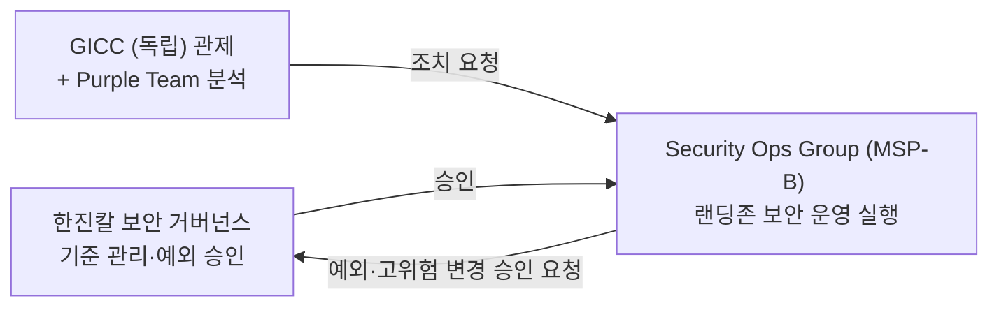
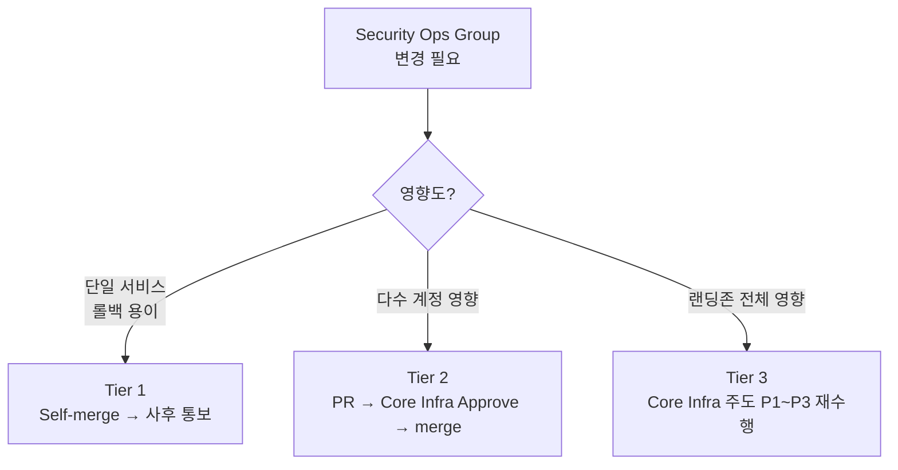

# Security Ops Group 역할 범위 및 업무 경계 정의

> 본 문서는 한진그룹 AWS 랜딩존에서 Core Infra Ops Group과 Security Ops Group의 업무 경계를 명확히 정의합니다.

---

## 보안 운영 체계에서 Security Ops Group의 위치

Security Ops Group(MSP-B)은 랜딩존 보안 운영 체계에서 **실행** 역할을 담당한다.
GICC의 Purple Team이 Findings를 분석하고 조치를 요청하면, Security Ops Group이 실제 AWS 설정 변경과 조치를 수행한다.



> 참조: [`Security/2026-06-16_랜딩존_보안_운영_역할.md`](../Security/2026-06-16_랜딩존_보안_운영_역할.md)
> 참조: [`Security/2026-06-16_랜딩존_보안_운영_RACI.md`](../Security/2026-06-16_랜딩존_보안_운영_RACI.md)

---

## 문서 버전

| 버전 | 날짜 | 변경 내용 |
|------|------|----------|
| v4.0 | 2026-06-18 | 구조 간소화: 1.3 섹션 제거 및 1.1 통합, 2.2 제거, 2.3 표 형식 변경, 섹션 4~6 별도 문서 분리 |
| v3.0 | 2026-06-18 | 구조 단순화: P1~P3/P4~P6 원칙 기반, 서비스별 분석 제거, 톤 중립화 |
| v2.0 | 2026-06-18 | 위임 모델 기반, 6-Phase 생명주기 도입, Tier 시스템 정의 |
| v1.0 | 2026-06-15 | 초안 작성 (인프라 vs 정책 레이어 접근) |

---

## 1. 업무 구분 원칙

### 1.1 6-Phase 업무 생명주기

모든 보안 서비스의 업무는 다음 6단계로 구분됩니다.

| Phase | 단계 | 설명 | 예시 |
|-------|------|------|------|
| **P1** | 기획/설계 | 아키텍처 검토, 적용 대상 확정 | SCP 적용 파이프라인 기획, NFW 아키텍처 설계 |
| **P2** | 구현 | 파이프라인·모듈·리소스 구조 구축 | Terraform 모듈, GitHub Actions, State backend 생성 |
| **P3** | 검증 | 배포 후 아키텍처 동작 확인 | Policy Staging 테스트, 인프라 검증 |
| **P4** | 상시 운영 | 모니터링, 이벤트 대응, SR 처리 | Purple Team 요청 처리 |
| **P5** | 정기 검토 | 유효성 검증, 불필요 룰 정리 | SCP 분기 리뷰, NFW Rule 정기 검증 |
| **P6** | 변경/폐기 | 정책 파일(YAML/JSON) 수정 및 배포 (코드 수정 없음) | 방화벽 룰 추가, 억제 룰 변경 |

> **P6 단계 참고**: P6 작업은 Core Infra Ops Group이 구축한 파이프라인과 템플릿을 활용하여 yaml/json 파일만 수정합니다. Terraform 코드나 파이프라인 스크립트 수정은 P2 단계의 Core Infra Ops Group 작업입니다.

### 1.2 업무 분담 원칙

**핵심 구분**:
- **P1~P3 = 랜딩존 아키텍처링** (거버넌스를 설계하고 실현하는 초기 구축)
  - → **Core Infra Ops Group** 담당 (Security Ops Group은 보안 관점 의견 제공)
- **P4~P6 = 일상 운영** (구축된 환경에서 발생하는 운영 업무)
  - → **Security Ops Group** 담당

### 1.3 이 원칙의 근거

| 근거 | 설명 |
|------|------|
| **일관성** | 랜딩존 전체의 아키텍처 일관성 유지. 모든 서비스(보안 포함)의 구조 설계는 Core Infra Ops Group이 책임 |
| **효율성** | Security Ops Group은 보안 정책 운영에 집중. 파이프라인/모듈 관리는 Core Infra Ops Group에 일원화 |
| **책임 명확화** | 아키텍처 = Core Infra Ops Group, 운영 = Security Ops Group으로 명확히 구분 |
| **기존 거버넌스와 정합** | 거버넌스 정책통제 문서의 "중앙 통제" 원칙과 일치 |

---

## 2. Security 도메인 서비스 범위

### 2.1 서비스별 담당 팀

P1~P3(아키텍처링)은 Core Infra Ops Group, P4~P6(일상 운영)은 Security Ops Group이 담당한다.
서비스를 4개 그룹으로 묶어 정리한다.

| 서비스 그룹 | 주요 서비스 | Core Infra Ops Group (P1~P3) | Security Ops Group (P4~P6) |
|-----------|-----------|------------------------------|---------------------------|
| **권한 통제** | SCP, RCP, Declarative Policies, Permission Boundary | OU 구조·파이프라인 구축 | 정책 YAML 수정, 위반 모니터링 |
| **방화벽** | NFW, WAF, FMS | 인프라·WebACL 구조·파이프라인 구축 | Rule YAML 수정 |
| **탐지** | GuardDuty, Security Hub, Config, IAM Access Analyzer, Inspector, Macie | Detector 활성화·파이프라인 구축 | GICC 조치 요청 접수 후 억제·아카이브 룰 설정, 보안 설정 변경 수행 |
| **접근·암호화·로그** | IAM Identity Center, KMS, CloudTrail | 초기 구성·파이프라인 구축 | 사용자·키·로그 운영 |

### 2.2 역할 분리 기준

#### 기본 원칙

| 구분 | Core Infra Ops Group | Security Ops Group |
|------|----------------|---------------|
| **P2 (구현)** | 파이프라인·모듈·리소스 구조 구축 ("틀" 제공) | - |
| **P6 (변경)** | - | 정책 파일(YAML/JSON) 수정 ("내용" 변경) |
| **예외 사항** | 아키텍처 변경이 필요한 경우 P1~P3 재수행 | 변경 요청 티켓 생성 |

#### 서비스 유형별 구분

**유형 1: 자원 자체가 Security Ops Group 관리 대상**
- 자원이 배포되었을 때 그 자원 자체가 Security Ops Group의 관리 대상
- **Core Infra Ops Group**: 배포 파이프라인 환경 구성 (P2), PR 승인 (Tier 2)
- **Security Ops Group**: 파이프라인을 이용한 자원 생성 코드 작성 (P6), 정책 등록/공유 설정
- **예시**: KMS Key, GuardDuty Detector, Security Hub, IAM Identity Center Permission Set

**유형 2: 자원에 정책을 추가로 관리**
- 자원이 배포되고 그 자원에 추가로 정책을 관리하면서 사용
- **Core Infra Ops Group**: 인프라 자원 구축 (P2), Security Ops Group이 정책 변경하기 쉽도록 코드 구조 제공, PR 승인 (Tier 2)
- **Security Ops Group**: 정책만 변경하는 코드 작성 (P6), 정책 YAML/JSON 파일 수정
- **예시**: NFW (인프라 + Rule), WAF (WebACL + Rule), FMS (Policy 구조 + Rule 내용), SCP (OU 구조 + 정책 내용)

---

## 3. Tier 및 협업 방식

### 3.1 Tier 정의 및 변경 흐름

P6 변경의 영향도에 따라 프로세스를 차등 적용한다.



| Tier | 변경 영향도 | 프로세스 |
|------|-----------|---------|
| **Tier 1** | 제한적 (단일 서비스, 롤백 용이) | Security Ops Group self-merge → Core Infra Ops Group 사후 통보 |
| **Tier 2** | 넓음 (다수 계정 영향) | Security Ops Group PR → Core Infra Ops Group 1건 이상 Approve → merge |
| **Tier 3** | 매우 넓음 (랜딩존 전체) | 아키텍처 변경 수준 → P1~P3 재수행 (Core Infra Ops Group 주도) |

**긴급 변경**: 보안 인시던트 시 "URGENT" 라벨 사용. Core Infra Ops Group은 영업시간 내 2시간, 영업시간 외 당일 리뷰. Break Glass 사용 시 사후 감사 필수.

---

## 4. 기존 업무 카탈로그와의 매핑

`운영_역할_업무_카탈로그.md`의 SEC-001~013, IAM-001~010 업무가 본 문서의 어느 Phase/Tier에 해당하는지:

| 업무 ID | 업무명 | Phase | Tier | 비고 |
|---------|--------|-------|------|------|
| SEC-001 | Security Hub 조치 요청 접수 및 처리 | P4 | Tier 1 | GICC Purple Team 조치 요청 후 Security Ops 실행 |
| SEC-002 | GuardDuty Finding 조치 수행 | P4 | Tier 1 | GICC 관제·분석 후 Security Ops 실행 |
| SEC-003 | SCP 정책 효과 검증 | P4 | Tier 2 | Core Infra Ops Group 리뷰 필요 |
| SEC-004 | Config Compliance 점검 | P4 | Tier 2 | |
| SEC-005 | IAM 정책 취약점 점검 | P5 | Tier 2 | |
| SEC-006 | Inspector 스캔 결과 기반 조치 수행 | P4 | Tier 1 | GICC 요청 접수 후 실행 |
| SEC-007 | SCP 정기 리뷰 | P5 | Tier 2 | Core Infra Ops Group 리뷰 필요 |
| SEC-008 | Conformance Pack 업데이트 | P6 | Tier 2 | Core Infra Ops Group 리뷰 필요 |
| SEC-009 | 보안 서비스 로그 연동 점검 | P4 | Tier 1 | |
| SEC-010 | IAM Access Analyzer Finding 기반 조치 수행 | P4 | Tier 1 | GICC 요청 접수 후 실행 |
| SEC-011 | SCP 적용 오류 해소 | P6 | Tier 2 | Core Infra Ops Group 리뷰 필요 |
| SEC-012 | KMS 키 사용 모니터링 | P4 | — | 모니터링(조회만) |
| SEC-013 | Macie Finding 기반 조치 수행 | P4 | Tier 1 | GICC 요청 접수 후 실행 |
| IAM-001 | IAM 권한 요청 SR 처리 | P4, P6 | Tier 2 | Permission Set 변경 |
| IAM-002 | 권한 예외 승인 요청 처리 | P6 | Tier 3 | 한진칼 보안 거버넌스 승인 필요 |
| IAM-003 | Permission Set 정기 감사 | P5 | Tier 2 | |
| IAM-004 | Identity Center 사용자 프로비저닝 | P4 | Tier 1 | |
| IAM-005 | Identity Center 그룹 관리 | P4 | Tier 2 | |
| IAM-006 | 미사용 권한 정리 | P5 | Tier 2 | |
| IAM-007 | Break Glass 권한 관리 | P4, P6 | Tier 3 | 랜딩존 긴급 접근 체계 변경으로 Core Infra Ops Group 협업 필수 |
| IAM-008 | IAM Role 신뢰 정책 검토 | P5 | Tier 2 | |
| IAM-009 | 워크로드 계정 IAM 권한 아키텍처 리뷰 | P5 | Tier 3 | 아키텍처 리뷰로 Core Infra Ops Group 주도, Security Ops Group 보안 정책 관점 협업 |
| IAM-010 | IAM 권한 인시던트 대응 | P4 | Tier 1~3 | 인시던트 성격에 따라 |

---

## 부록 A: 역할 분리 상세 예시

### A.1 NFW (AWS Network Firewall)

**서비스 유형**: 유형 2 (자원에 정책을 추가로 관리)

| 구분 | 담당 팀 | 업무 범위 |
|------|---------|----------|
| **인프라 레이어** | Core Infra Ops Group | VPC attachment, endpoint, routing, Inspection VPC, Rule Group 리소스 구축 (P2) |
| **룰 레이어** | Security Ops Group | Rule Group 정의 YAML 수정, 차단/허용 룰 추가/삭제 (P6) |

**Core Infra Ops Group의 역할**:
- P2: NFW 인프라 구축 + Rule Group Terraform 리소스 생성 + Security Ops Group이 룰 정의 YAML만 수정하면 되도록 코드 구조 제공
- Tier 2: Security Ops Group이 룰 YAML 수정 시 PR 리뷰

**Security Ops Group의 역할**:
- P6: `nfw-rules/rules.yaml` 같은 정책 파일만 수정. 인프라 코드는 건드리지 않음

**분리 근거**: NFW 인프라는 네트워크 아키텍처의 일부이므로 Core Infra Ops Group 도메인. 보안 룰 운영만 Security Ops Group.

---

### A.2 SCP / RCP

**서비스 유형**: 유형 2 (자원에 정책을 추가로 관리)

| 구분 | 담당 팀 | 업무 범위 |
|------|---------|----------|
| **거버넌스 실현** | Core Infra Ops Group | OU 구조 설계, SCP 리소스 구축, OU attachment Terraform 구조 (P2) |
| **정책 운영** | Security Ops Group | SCP 정책 내용 YAML 수정, 위반 모니터링, 정기 리뷰 (P4~P6) |

**Core Infra Ops Group의 역할**:
- P2: OU 구조 + SCP 배포 파이프라인 구축 + Security Ops Group이 정책 내용 YAML만 수정하면 OU에 자동 적용되도록 구조 제공
- Tier 2/3: Security Ops Group이 정책 YAML 수정 시 PR 리뷰 (SCP 신규는 Tier 3)

**Security Ops Group의 역할**:
- P6: `scp/policies/deny-root-user.yaml` 같은 정책 내용 파일만 수정. OU attachment 코드는 건드리지 않음

**분리 근거**: OU 구조는 Core Infra Ops Group 소유. Security Ops Group은 정책 내용 운영.

---

### A.3 KMS

**서비스 유형**: 유형 1 (자원 자체가 Security Ops Group 관리 대상)

| 구분 | 담당 팀 | 업무 범위 |
|------|---------|----------|
| **파이프라인 구성** | Core Infra Ops Group | KMS Key 배포 파이프라인 환경 구성 (P2) |
| **키 생성 및 정책** | Security Ops Group | 파이프라인을 이용해서 KMS Key 생성 코드 작성, Key Policy JSON 작성, 공유 설정 (P6) |

**Core Infra Ops Group의 역할**:
- P2: KMS Key를 배포할 수 있는 파이프라인 구성 (Terraform 모듈, State backend, OIDC 권한)
- Tier 2: Security Ops Group이 키 생성 코드 작성 시 PR 리뷰

**Security Ops Group의 역할**:
- P6: `kms/keys/security-hub-key.yaml` 같은 키 정의 파일 작성 (키 이름, 설명, Key Policy JSON, 공유 대상 계정 등)
- 파이프라인이 이 YAML을 읽어 자동으로 KMS Key 생성

**예시 YAML 구조**:
```yaml
# kms/keys/security-hub-key.yaml
key_alias: alias/security-hub-encryption
description: "Security Hub Finding 암호화 키"
key_policy:
  Version: "2012-10-17"
  Statement:
    - Sid: Enable IAM policies
      Effect: Allow
      Principal:
        AWS: "arn:aws:iam::123456789012:root"
      Action: "kms:*"
      Resource: "*"
shared_accounts:
  - "234567890123"  # Workload 계정
  - "345678901234"
```

**분리 근거**: 키 자체는 Security Ops Group이 관리하는 보안 자원. Core Infra Ops Group은 배포 환경만 제공.

---

### A.4 CloudTrail

**서비스 유형**: 하이브리드 (인프라는 Core Infra, 활용은 Security Ops Group)

| 구분 | 담당 팀 | 업무 범위 |
|------|---------|----------|
| **인프라 구성** | Core Infra Ops Group | CloudTrail 생성, S3 버킷 구성, 로그 보관 정책 설정 (P2) |
| **모니터링 및 감사** | Security Ops Group | CloudTrail 로그 모니터링, 이상 행위 탐지, 감사 리포트 작성 (P4) |

**Core Infra Ops Group의 역할**:
- P2: Organization Trail 구성, S3 버킷 생성, 로그 수명주기 정책 설정
- P2: CloudTrail 설정 변경 (로그 범위, 이벤트 유형 등)

**Security Ops Group의 역할**:
- P4: CloudTrail 로그를 Security Hub, Athena 등으로 분석
- P4: 이상 행위 탐지 및 트리아지
- P4: 감사 요청 시 로그 추출 및 리포트 작성

**분리 근거**: CloudTrail 인프라 구성은 랜딩존 아키텍처의 일부이므로 Core Infra Ops Group. 로그 활용 및 모니터링은 Security Ops Group의 보안 운영 업무.

---

### A.5 FMS (Firewall Manager)

**서비스 유형**: 유형 2 (자원에 정책을 추가로 관리)

| 구분 | 담당 팀 | 업무 범위 |
|------|---------|----------|
| **정책 구조** | Core Infra Ops Group | 어떤 OU에 어떤 Policy를 적용할지 FMS Security Policy Terraform 작성 (P2) |
| **룰 내용** | Security Ops Group | WAF Rule Group, NFW Rule Group 정의 YAML 수정 (P6) |

**Core Infra Ops Group의 역할**:
- P2: FMS Security Policy 구조 구축 (어떤 OU에 WAF/NFW Policy를 적용할지) + Security Ops Group이 룰 내용 YAML만 수정하면 되도록 구조 제공
- Tier 2: Security Ops Group이 룰 YAML 수정 시 PR 리뷰

**Security Ops Group의 역할**:
- P6: `fms/waf-rules/sql-injection.yaml` 같은 룰 내용 파일만 수정. FMS Policy 적용 구조는 건드리지 않음

**분리 근거**: OU 적용 구조는 랜딩존 아키텍처, 룰 내용은 보안 운영.

---

## 부록 B: 용어 정리

| 용어 | 정의 |
|------|------|
| **6-Phase 생명주기** | 기획(P1) → 구현(P2) → 검증(P3) → 운영(P4) → 검토(P5) → 변경(P6) |
| **Tier** | P6 변경의 영향도에 따른 프로세스 차등. Tier 1(자율), Tier 2(리뷰), Tier 3(승인) |
| **Core Infra Ops Group** | 랜딩존 플랫폼·네트워크·IaC 담당. P1~P3(아키텍처링) 주도 |
| **Security Ops Group** | 보안 서비스 운영 담당. P4~P6(일상 운영) 주도 |
| **7-Layer 통제 모델** | 거버넌스 정책통제 문서의 계층 구조 (L1~L7) |
| **Break Glass** | 긴급 시 정상 권한 체계를 우회하는 제한적 긴급 권한 |

---

## 부록 C: 관련 문서

- [Security_Team_협업_프로세스_상세.md](./Security_Team_협업_프로세스_상세.md): Tier별 상세 프로세스, P6 작업 흐름, 협업 방식
- `운영_역할_업무_카탈로그.md`: 전체 운영 업무 카탈로그
- `거버넌스_정책통제_체계.md`: 7-Layer 통제 모델 상세

---

**[문서 끝]**
